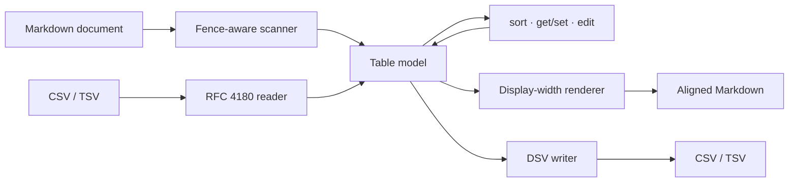

# tablewright

[English](README.md) | [中文](README.zh.md) | [日本語](README.ja.md)

[](LICENSE)   [](CONTRIBUTING.md)

**オープンソースの Markdown テーブルツールキット——整形・揃え・列ソート・アドレス指定のセル編集、そして CSV/TSV との相互変換を、完全オフライン・依存ゼロで。**


```bash
# not yet on npm — install from a checkout of this repository
npm install && npm run build && npm pack
npm install -g ./tablewright-0.1.0.tgz
```

## なぜ tablewright？

パイプテーブルの手作業での桁揃えは万人共通の苦役です：セルを一つ直せば、その列の縦線が全部ずれる。フォーマッタが解決するのはその一切れだけ——Prettier はテーブルを整形できてもソートはできず、定番の `markdown-table` パッケージは CLI のないライブラリで、エディタ拡張は同じ機能を特定エディタのキーバインドに閉じ込めます。どれもテーブルを*データ*として扱いません：価格列でソートする、スクリプトから B2 セルを書き換える、表を CSV に出して表計算ソフトで加工し戻す——となれば正規表現の外科手術です。tablewright はすべてのパイプテーブルをアドレス指定可能なグリッドとして扱い、完全なローカルツールチェーンを提供します：**整形**（表示幅ベースなので CJK 列も揃う）、**ソート**（数値/自然順/安定、空セルは常に最後）、**編集**（表計算式アドレス、行 0 がヘッダー）、**変換**（RFC 4180 の CSV/TSV 入出力、バイト単位で一致するラウンドトリップ）。

|  | tablewright | Prettier | markdown-table | VS Code テーブル拡張 |
|---|---|---|---|---|
| パイプテーブルの整列 | 対応、CJK 表示幅を認識 | 対応 | 対応（ライブラリとして） | 対応 |
| 列でソート | 数値 / 自然順 / 文字列、安定 | 非対応 | 非対応 | 一部、文字列順のみ |
| アドレス指定のセル編集 | `B2`、行 0 = ヘッダー | 非対応 | 非対応 | 非対応 |
| CSV/TSV の入出力 | 対応、往復でバイト一致 | 非対応 | 非対応 | 良くて貼り付け取り込み |
| スクリプト可能な CLI | 終了コード 0/1/2、stdin/stdout | `--check` のみ | CLI なし | エディタに固定 |
| ランタイム依存 | 0 | 多数 | 0 | エディタ本体 |

<sub>各機能・依存関係の記述は各プロジェクトの公開ドキュメントで確認、2026-07。</sub>

## 特徴

- **CJK でも崩れない整列** —— パディングは表示幅で計算（東アジアの全角文字は 2 桁、結合文字は 0 桁）。`部品セット` と `Widget` がどの等幅フォントでもぴったり揃います。
- **データを理解するソート** —— `--by "Unit price" --desc` は数値列（`$1,200`、`42%`、`1.5e3`）を自動判定し、それ以外は自然順（`v9` < `v10`）に。ソートは安定で、空セルは常に最下部へ沈みます。
- **セルにはアドレスがある** —— `get B2`、`set C1 "$8.75"`、行 0 がヘッダー。`edit` は `--set` / `--add-row` / `--del-row` / `--add-col` / `--del-col` を左から右へ連結します。
- **バイト一致の CSV ラウンドトリップ** —— RFC 4180 の引用規則。フィールド内改行は `<br>` として Markdown を通過し、戻りで実改行に復元。csv → md → csv の同一性はテストで強制しています。
- **外科手術のような書き換え** —— 変わるのはテーブル行だけ：本文・フェンス付きコードブロック・字下げの例はバイト単位で素通りし、整形は冪等です。
- **ランタイム依存ゼロ、完全オフライン** —— 必要なのは Node.js だけ。ツールはソケットを一切開かず、devDependency は `typescript` のみです。

## クイックスタート

同梱サンプルを価格の高い順にソートします：

```bash
# from the root of your checkout
tablewright sort examples/inventory.md --by "Unit price" --desc
```

出力（実際の実行結果、最初のテーブルのみ表示）：

```text
| Item                         | Qty | Unit price | Notes         |
| ---------------------------- | --: | ---------: | ------------- |
| Gadget with a very long name |  10 |     $1,200 |               |
| 部品セット                   |   3 |     ¥1,000 | JP supplier   |
| Widget                       |   2 |      $9.50 | reorder soon  |
| Sprocket                     |     |      $3.25 | count pending |
```

テーブルの周囲のドキュメントは無傷のまま。空の `Qty` セルは最後に並びます。続いてセルを読み、表を表計算ソフト向けに書き出します（実際の実行結果）：

```bash
tablewright get B2 examples/inventory.md
tablewright convert examples/inventory.md --to csv
```

```text
10
Item,Qty,Unit price,Notes
Widget,2,$9.50,reorder soon
Gadget with a very long name,10,"$1,200",
部品セット,3,"¥1,000",JP supplier
Sprocket,,$3.25,count pending
```

逆方向も：`tablewright convert examples/prices.csv --align lrn` は CSV——引用符付きカンマ、埋め込み改行さえも——を整列済みテーブルに変えます（実際の実行結果）：

```text
| item     | price | notes                           |
| :------- | ----: | ------------------------------- |
| widget   |  9.50 | plain field                     |
| gadget   | 1,200 | comma, inside a quoted field    |
| sprocket |  3.25 | two<br>lines via a real newline |
```

さらなるシナリオは [examples/](examples/README.md) へ。

## コマンド

| コマンド | 役割 | 主なオプション |
|---|---|---|
| `fmt [files...]` | すべてのパイプテーブルを整列；それ以外は素通し | `--write`、`--check`（終了コード 1） |
| `sort` | テーブルのデータ行を列でソート | `--by`、`--desc`、`--mode` |
| `get <ref>` | セル（`B2`）・行（`2`）・列（`Price`）を表示 | `--table` |
| `set <addr> <value>` | セルを 1 つ設定；行 0 はヘッダーの改名 | `--table`、`--write` |
| `edit` | 連結した操作を左から右へ適用 | `--set`、`--add-row`、`--del-row`、`--add-col`、`--del-col` |
| `convert` | Markdown ↔ CSV ↔ TSV | `--from`、`--to`、`--align`、`--table` |
| `info` | 全テーブルを一覧：位置・サイズ・ヘッダー | — |

どのコマンドもファイル（または stdin）を読み stdout へ出力します。書き換え系のコマンド（`fmt`・`sort`・`set`・`edit`）は `--write` でファイルをその場で書き換え、複数テーブルがある文書では `--table N` で選択します。終了コードは共通：`0` 成功、`1` は `fmt --check` が未整形の入力を検出、`2` は用法または I/O エラー——スクリプトが「汚れたファイル」と「壊れた呼び出し」を区別できます。

## セルと列のアドレス指定

| 参照形式 | 例 | 意味 |
|---|---|---|
| 英字 + 行番号 | `get B2` | セル 1 つ；行 0 はヘッダー行 |
| ヘッダー文字列 | `--by "Unit price"` | 名前で列を選択（完全一致、次に大文字小文字無視） |
| `#N` | `--by #3` | 1 起点の番号で列を選択；ヘッダーには絶対に一致しない |
| 英字 | `--del-col C` | 文字で列を選択（`A`、`B`、… `AA`） |
| 数字のみ | `get 2` | `get` では行全体；それ以外では 1 起点の列番号 |

ヘッダー文字列が意図的に英字より優先されるため、たまたま `B` という名前の列にも名前でアクセスできます——ヘッダーを無視した位置の意味が必要なら `#N` を。解決順序の全容、エスケープ規則（`\|`）、`<br>` 改行の取り決めは [docs/addressing.md](docs/addressing.md) に明記しています。

## アーキテクチャ



## ロードマップ

- [x] CJK 対応フォーマッタ、列ソート、セルのアドレス指定と編集、CSV/TSV ラウンドトリップ、`info`、スクリプト向け終了コード（v0.1.0）
- [ ] `get` / `set` の範囲アドレス（`B2:B5`）
- [ ] `edit` への `transpose` と列並べ替え操作
- [ ] `info` と `get` の JSON 出力
- [ ] 列幅上限と `<br>` によるセル折り返し
- [ ] pandoc グリッドテーブル入力

全リストは [open issues](https://github.com/JaydenCJ/tablewright/issues) を参照してください。

## コントリビュート

コントリビュート歓迎です。`npm install && npm run build` でビルドし、`npm test` と `bash scripts/smoke.sh`（`SMOKE OK` が出ること）を実行してください——本リポジトリに CI はなく、上記の主張はすべてローカル実行で検証しています。[CONTRIBUTING.md](CONTRIBUTING.md) を読み、[good first issue](https://github.com/JaydenCJ/tablewright/issues?q=is%3Aissue+is%3Aopen+label%3A%22good+first+issue%22) を選ぶか、[discussion](https://github.com/JaydenCJ/tablewright/discussions) を始めてください。

## ライセンス

[MIT](LICENSE)
