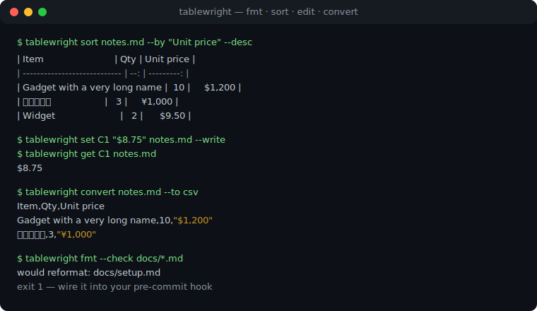
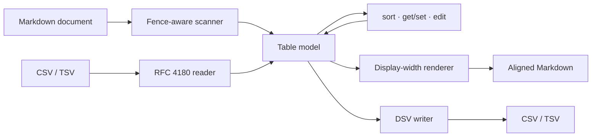

# tablewright

[English](README.md) | [中文](README.zh.md) | [日本語](README.ja.md)

[](LICENSE)   [](CONTRIBUTING.md)

**An open-source Markdown table toolkit — format, align, sort, edit cells by address and round-trip CSV/TSV, offline and dependency-free.**



```bash
# not yet on npm — install from a checkout of this repository
npm install && npm run build && npm pack
npm install -g ./tablewright-0.1.0.tgz
```

## Why tablewright?

Hand-aligning pipe tables is universal drudgery: one edited cell and every pipe in the column is off by three. Formatters solve exactly that slice and stop — Prettier reflows a table but cannot sort it, the classic `markdown-table` package is a library without a CLI, and editor extensions lock the same features inside one editor's keybindings. None of them treat the table as *data*: sorting by a price column, changing cell B2 from a script, or pulling the table out as CSV for a spreadsheet and putting it back means regex surgery. tablewright treats every pipe table as an addressable grid with a full local toolchain: **format** (display-width aware, so CJK columns align), **sort** (numeric/natural/stable, empties last), **edit** (spreadsheet-style addresses, row 0 is the header) and **convert** (RFC 4180 CSV/TSV in and out, byte-identical round-trip).

|  | tablewright | Prettier | markdown-table | VS Code table extensions |
|---|---|---|---|---|
| Aligns pipe tables | yes, CJK display-width aware | yes | yes (as a library) | yes |
| Sorts by column | numeric / natural / string, stable | no | no | some, string-only |
| Edits cells by address | `B2`, row 0 = header | no | no | no |
| CSV/TSV in and out | yes, byte-identical round-trip | no | no | paste-import at best |
| Scriptable CLI | exit codes 0/1/2, stdin/stdout | `--check` only | no CLI | editor-bound |
| Runtime dependencies | 0 | many | 0 | an editor |

<sub>Capability and dependency claims checked against each project's public docs, 2026-07.</sub>

## Features

- **Alignment that survives CJK** — padding is computed from display width (East Asian Wide characters count two columns, combining marks zero), so `部品セット` and `Widget` line up in every monospace font.
- **Sort that understands your data** — `--by "Unit price" --desc` auto-detects numeric columns (`$1,200`, `42%`, `1.5e3`), falls back to natural order (`v9` < `v10`), stays stable, and always sinks empty cells to the bottom.
- **Cells have addresses** — `get B2`, `set C1 "$8.75"`, row 0 is the header; `edit` chains `--set` / `--add-row` / `--del-row` / `--add-col` / `--del-col` left to right.
- **Byte-identical CSV round-trips** — RFC 4180 quoting, and embedded newlines travel through Markdown as `<br>` and come back as real newlines; csv → md → csv equality is enforced by tests.
- **Surgical rewrites** — only table lines change: prose, fenced code blocks and indented examples pass through byte-for-byte, and formatting is idempotent.
- **Zero runtime dependencies, fully offline** — Node.js is the only requirement; the tool never opens a socket, and `typescript` is the sole devDependency.

## Quickstart

Sort the bundled example by price, highest first:

```bash
# from the root of your checkout
tablewright sort examples/inventory.md --by "Unit price" --desc
```

Output (real captured run, first table shown):

```text
| Item                         | Qty | Unit price | Notes         |
| ---------------------------- | --: | ---------: | ------------- |
| Gadget with a very long name |  10 |     $1,200 |               |
| 部品セット                   |   3 |     ¥1,000 | JP supplier   |
| Widget                       |   2 |      $9.50 | reorder soon  |
| Sprocket                     |     |      $3.25 | count pending |
```

The document around the table is untouched; the empty `Qty` cell sorts last. Now read a cell and export the table for a spreadsheet (real captured run):

```bash
tablewright get B2 examples/inventory.md
tablewright convert examples/inventory.md --to csv
```

```text
10
Item,Qty,Unit price,Notes
Widget,2,$9.50,reorder soon
Gadget with a very long name,10,"$1,200",
部品セット,3,"¥1,000",JP supplier
Sprocket,,$3.25,count pending
```

And back: `tablewright convert examples/prices.csv --align lrn` turns a CSV — quoted commas, even embedded newlines — into an aligned table (real captured run):

```text
| item     | price | notes                           |
| :------- | ----: | ------------------------------- |
| widget   |  9.50 | plain field                     |
| gadget   | 1,200 | comma, inside a quoted field    |
| sprocket |  3.25 | two<br>lines via a real newline |
```

More scenarios live in [examples/](examples/README.md).

## Commands

| Command | Does | Key options |
|---|---|---|
| `fmt [files...]` | align every pipe table; everything else passes through | `--write`, `--check` (exit 1) |
| `sort` | sort a table's body rows by a column | `--by`, `--desc`, `--mode` |
| `get <ref>` | print a cell (`B2`), a row (`2`) or a column (`Price`) | `--table` |
| `set <addr> <value>` | set one cell; row 0 renames headers | `--table`, `--write` |
| `edit` | chained operations, applied left to right | `--set`, `--add-row`, `--del-row`, `--add-col`, `--del-col` |
| `convert` | Markdown ↔ CSV ↔ TSV | `--from`, `--to`, `--align`, `--table` |
| `info` | list every table: position, size, headers | — |

Every command reads a file (or stdin) and prints to stdout. The rewriting commands (`fmt`, `sort`, `set`, `edit`) accept `--write` to edit the file in place, and `--table N` picks a table when the document has several. Exit codes are shared: `0` ok, `1` `fmt --check` found unformatted input, `2` usage or I/O error — so scripts can tell a dirty file from a broken invocation.

## Addressing cells and columns

| Reference | Example | Meaning |
|---|---|---|
| letters + row | `get B2` | one cell; row 0 is the header row |
| header text | `--by "Unit price"` | column by name (exact, then case-insensitive) |
| `#N` | `--by #3` | column by 1-based index; never matches a header |
| letters | `--del-col C` | column by letter (`A`, `B`, … `AA`) |
| bare number | `get 2` | whole row in `get`; 1-based column index elsewhere |

Header text deliberately wins over letters, so a column literally named `B` stays reachable by name — use `#N` when you need the positional meaning regardless of headers. The full resolution order, escape rules (`\|`) and the `<br>` newline contract are specified in [docs/addressing.md](docs/addressing.md).

## Architecture



## Roadmap

- [x] CJK-aware formatter, column sort, cell addressing and edits, CSV/TSV round-trip, `info`, script-friendly exit codes (v0.1.0)
- [ ] Range addresses (`B2:B5`) for `get` and `set`
- [ ] `transpose` and column-reordering operations in `edit`
- [ ] JSON output for `info` and `get`
- [ ] Column-width caps with cell wrapping via `<br>`
- [ ] pandoc grid-table input

See the [open issues](https://github.com/JaydenCJ/tablewright/issues) for the full list.

## Contributing

Contributions are welcome. Build with `npm install && npm run build`, then run `npm test` and `bash scripts/smoke.sh` (must print `SMOKE OK`) — this repository ships no CI, every claim above is verified by local runs. See [CONTRIBUTING.md](CONTRIBUTING.md), grab a [good first issue](https://github.com/JaydenCJ/tablewright/issues?q=is%3Aissue+is%3Aopen+label%3A%22good+first+issue%22), or start a [discussion](https://github.com/JaydenCJ/tablewright/discussions).

## License

[MIT](LICENSE)
