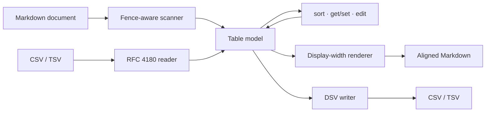

# tablewright

[English](README.md) | [中文](README.zh.md) | [日本語](README.ja.md)

[](LICENSE)   [](CONTRIBUTING.md)

**开源的 Markdown 表格工具箱——格式化、对齐、按列排序、按地址编辑单元格，并与 CSV/TSV 双向转换，完全离线、零依赖。**


```bash
# not yet on npm — install from a checkout of this repository
npm install && npm run build && npm pack
npm install -g ./tablewright-0.1.0.tgz
```

## 为什么选择 tablewright？

手工对齐管道表格是所有人共同的苦差事：改一个单元格，整列的竖线就全歪了。格式化工具只解决这一小块就止步了——Prettier 能重排表格却不能排序，经典的 `markdown-table` 包是个没有 CLI 的库，编辑器扩展则把同样的功能锁在某一个编辑器的快捷键里。它们都不把表格当作*数据*：想按价格列排序、想在脚本里改 B2 单元格、想把表格导出成 CSV 交给电子表格再放回来，就只能上正则手术。tablewright 把每个管道表格都视为可寻址的网格，并提供完整的本地工具链：**格式化**（按显示宽度计算，CJK 列也能对齐）、**排序**（数值/自然/稳定，空单元格永远垫底）、**编辑**（电子表格式地址，第 0 行是表头）以及**转换**（RFC 4180 的 CSV/TSV 进出，往返逐字节一致）。

|  | tablewright | Prettier | markdown-table | VS Code 表格扩展 |
|---|---|---|---|---|
| 对齐管道表格 | 是，感知 CJK 显示宽度 | 是 | 是（仅作为库） | 是 |
| 按列排序 | 数值 / 自然 / 字符串，稳定 | 否 | 否 | 部分，仅字符串序 |
| 按地址编辑单元格 | `B2`，第 0 行 = 表头 | 否 | 否 | 否 |
| CSV/TSV 进出 | 是，往返逐字节一致 | 否 | 否 | 至多粘贴导入 |
| 可脚本化的 CLI | 退出码 0/1/2、stdin/stdout | 仅 `--check` | 无 CLI | 绑定编辑器 |
| 运行时依赖 | 0 | 很多 | 0 | 一个编辑器 |

<sub>各项能力与依赖说明均对照各项目公开文档核实，2026-07。</sub>

## 特性

- **CJK 也不跑偏的对齐** —— 填充按显示宽度计算（东亚全宽字符算两列，组合用附加符号算零列），`部品セット` 和 `Widget` 在任何等宽字体里都对得整整齐齐。
- **懂数据的排序** —— `--by "Unit price" --desc` 自动识别数值列（`$1,200`、`42%`、`1.5e3`），否则退回自然序（`v9` < `v10`），排序稳定，空单元格永远沉到底部。
- **单元格有地址** —— `get B2`、`set C1 "$8.75"`，第 0 行是表头；`edit` 从左到右串联 `--set` / `--add-row` / `--del-row` / `--add-col` / `--del-col`。
- **逐字节一致的 CSV 往返** —— RFC 4180 引号规则，字段里的换行以 `<br>` 穿过 Markdown、回程还原成真换行；csv → md → csv 的相等性由测试强制保证。
- **外科手术式改写** —— 只有表格行会变：正文、围栏代码块和缩进示例逐字节原样通过，且格式化是幂等的。
- **零运行时依赖，完全离线** —— 只需要 Node.js；工具从不打开任何套接字，`typescript` 是唯一的 devDependency。

## 快速上手

把自带示例按价格从高到低排序：

```bash
# from the root of your checkout
tablewright sort examples/inventory.md --by "Unit price" --desc
```

输出（真实运行结果，只展示第一张表）：

```text
| Item                         | Qty | Unit price | Notes         |
| ---------------------------- | --: | ---------: | ------------- |
| Gadget with a very long name |  10 |     $1,200 |               |
| 部品セット                   |   3 |     ¥1,000 | JP supplier   |
| Widget                       |   2 |      $9.50 | reorder soon  |
| Sprocket                     |     |      $3.25 | count pending |
```

表格周围的文档原封不动；空的 `Qty` 单元格排在最后。接着读取一个单元格，并把表格导出给电子表格用（真实运行结果）：

```bash
tablewright get B2 examples/inventory.md
tablewright convert examples/inventory.md --to csv
```

```text
10
Item,Qty,Unit price,Notes
Widget,2,$9.50,reorder soon
Gadget with a very long name,10,"$1,200",
部品セット,3,"¥1,000",JP supplier
Sprocket,,$3.25,count pending
```

反向也行：`tablewright convert examples/prices.csv --align lrn` 把一份 CSV——带引号的逗号、甚至内嵌换行——变成对齐好的表格（真实运行结果）：

```text
| item     | price | notes                           |
| :------- | ----: | ------------------------------- |
| widget   |  9.50 | plain field                     |
| gadget   | 1,200 | comma, inside a quoted field    |
| sprocket |  3.25 | two<br>lines via a real newline |
```

更多场景见 [examples/](examples/README.md)。

## 命令

| 命令 | 作用 | 关键选项 |
|---|---|---|
| `fmt [files...]` | 对齐每一个管道表格；其余内容原样通过 | `--write`、`--check`（退出码 1） |
| `sort` | 按某一列对表格数据行排序 | `--by`、`--desc`、`--mode` |
| `get <ref>` | 打印单元格（`B2`）、整行（`2`）或整列（`Price`） | `--table` |
| `set <addr> <value>` | 设置一个单元格；第 0 行即重命名表头 | `--table`、`--write` |
| `edit` | 串联操作，从左到右依次应用 | `--set`、`--add-row`、`--del-row`、`--add-col`、`--del-col` |
| `convert` | Markdown ↔ CSV ↔ TSV | `--from`、`--to`、`--align`、`--table` |
| `info` | 列出所有表格：位置、尺寸、表头 | — |

每个命令都读取文件（或 stdin）并输出到 stdout。会改写文档的命令（`fmt`、`sort`、`set`、`edit`）接受 `--write` 就地改写文件；文档里有多张表时用 `--table N` 选择。退出码统一：`0` 成功，`1` 表示 `fmt --check` 发现未格式化的输入，`2` 表示用法或 I/O 错误——脚本因此能区分“文件脏了”和“命令用错了”。

## 单元格与列的寻址

| 引用形式 | 示例 | 含义 |
|---|---|---|
| 字母 + 行号 | `get B2` | 单个单元格；第 0 行是表头行 |
| 表头文本 | `--by "Unit price"` | 按名字选列（先精确匹配，再忽略大小写） |
| `#N` | `--by #3` | 按 1 起的序号选列；永远不会匹配表头 |
| 字母 | `--del-col C` | 按字母选列（`A`、`B`、… `AA`） |
| 纯数字 | `get 2` | 在 `get` 里是整行；其他地方是 1 起的列序号 |

表头文本刻意优先于字母，所以名字恰好叫 `B` 的列仍然可以按名访问——需要无视表头的纯位置语义时用 `#N`。完整的解析顺序、转义规则（`\|`）以及 `<br>` 换行契约见 [docs/addressing.md](docs/addressing.md)。

## 架构



## 路线图

- [x] 感知 CJK 的格式化器、按列排序、单元格寻址与编辑、CSV/TSV 往返、`info`、脚本友好的退出码（v0.1.0）
- [ ] `get` 与 `set` 支持区间地址（`B2:B5`）
- [ ] `edit` 中的 `transpose` 与列重排操作
- [ ] `info` 与 `get` 的 JSON 输出
- [ ] 列宽上限，超宽单元格用 `<br>` 折行
- [ ] pandoc 网格表格输入

完整列表见 [open issues](https://github.com/JaydenCJ/tablewright/issues)。

## 参与贡献

欢迎贡献。先 `npm install && npm run build` 构建，再运行 `npm test` 和 `bash scripts/smoke.sh`（必须打印 `SMOKE OK`）——本仓库不带 CI，上面的每一条主张都由本地运行验证。请阅读 [CONTRIBUTING.md](CONTRIBUTING.md)，认领一个 [good first issue](https://github.com/JaydenCJ/tablewright/issues?q=is%3Aissue+is%3Aopen+label%3A%22good+first+issue%22)，或发起一场 [discussion](https://github.com/JaydenCJ/tablewright/discussions)。

## 许可证

[MIT](LICENSE)
